# PETRA III GUI Calculator Benchmark

## 1. Objective

This practical exercise compares two independent pyLOCO settings:

- **Response Matrix Calculator**: Linear, Analytical, or Tracking. This controls how pyLOCO calculates the model Orbit Response Matrix (ORM).
- **Normal quadrupole Jacobian**: Numerical or Analytical. This controls how pyLOCO calculates the derivative of the ORM with respect to fitted normal-quadrupole strengths, dORM/dK.

They are different controls and must be varied independently.

With a **Numerical** Jacobian, pyLOCO perturbs the quadrupoles and uses finite differences. The perturbed ORMs use the selected Response Matrix Calculator:

- Linear ORM + Numerical Jacobian → numerical derivative of the Linear ORM
- Analytical ORM + Numerical Jacobian → numerical derivative of the Analytical ORM
- Tracking ORM + Numerical Jacobian → numerical derivative of the Tracking ORM

With an **Analytical** Jacobian, pyLOCO uses the existing analytical quadrupole derivative directly. The selected ORM calculator still controls model and residual evaluations, but it does not alter the analytical derivative formula.

You will compare correction quality, χ², ORM residuals, beta beating, dispersion, fitted parameters, convergence, and computation time.

---

## 2. Before you start

All paths in this tutorial are relative to the pyLOCO repository root.

### 2.1 Start and load the project

1. From the repository root, start:

   ```bash
   pyloco-gui
   ```

2. Select **File → Open…**.
3. Navigate inside the pyLOCO repository to:

   ```text
   Examples/PETRAIII/GUI/petra_iii.pyloco.json
   ```

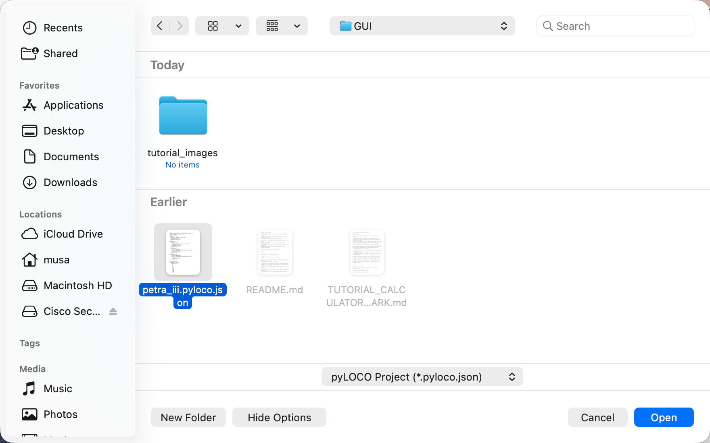

> Show **File → Open…** and `petra_iii.pyloco.json`.

The Project view should show the PETRA III project as complete, with validation passed and **Run LOCO** enabled. Opening the project does not start a fit.

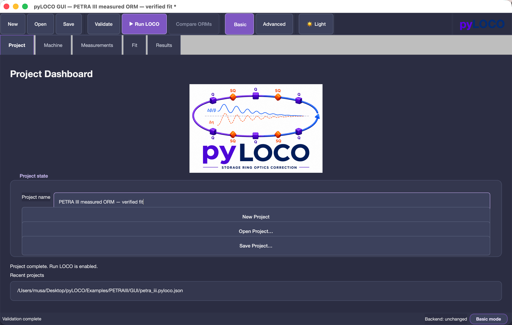

> Show the project name, successful validation, and enabled Run LOCO action.

### 2.2 Verify the supplied configuration

Do not manually select BPMs, correctors, quadrupoles, measurement files, or lattice elements. The verified project already contains these selections.

| Item | Expected value |
|---|---:|
| Lattice | `Examples/PETRAIII/data/p3_low_beta.mat` |
| Lattice elements | 7,675 |
| BPMs | 246 |
| Horizontal correctors | 219 |
| Vertical correctors | 194 |
| Normal quadrupoles | 398 |
| Skew quadrupoles | 16 |
| Measured ORM | `measured_orm_loco.h5` |
| Measured dispersion | `measured_dispersion_loco.h5` |
| BPM noise | `measured_BPM_noise_loco.h5` |

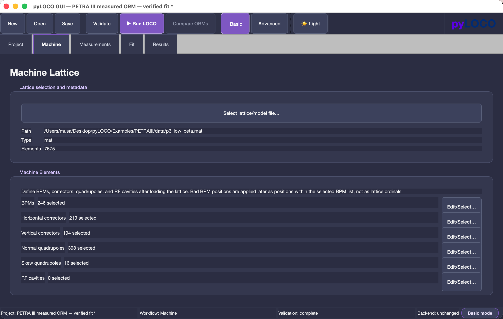

> Show the lattice and selected BPM, corrector, and quadrupole counts.

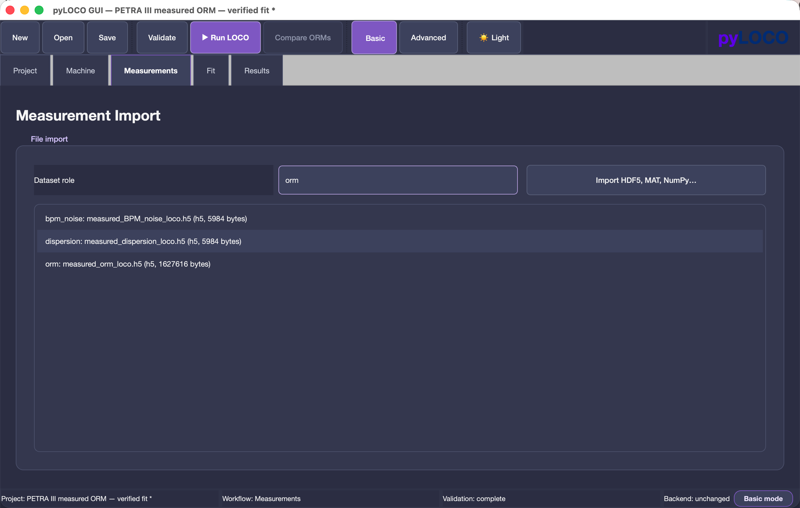

> Show the ORM, dispersion, and BPM-noise files.

### 2.3 Verify corrector steps and initialization

In **Corrector Steps**, confirm:

- **Corrector step mode**: Load from file
- **CM-step .npz file**: `Examples/PETRAIII/data/CMstep.npz`

The GUI label is **Load from file**. These measured per-corrector steps must not be replaced with uniform values.


> Highlight **Load from file** and `CMstep.npz`.

In **Initialization / Resume**, select **Start from current model**. Do not select **Resume from previous LOCO state** for an independent benchmark run.

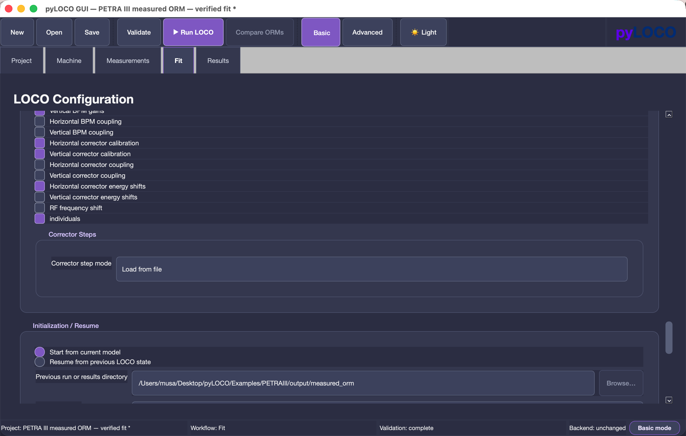

> Highlight **Start from current model** and the Resume option that must not be used.

### 2.4 Settings that must not change

Change only the calculator selector(s) and **Outer iterations** required by an exercise. Do not change:

- lattice, measurements, or machine-element selections;
- active fit parameters or parameter initialization;
- corrector-step file or kick/RF settings;
- solver, LM, SVD, rejection, normalization, or coupling settings;
- constraints;
- the dispersion-objective setting.

This project supplies dispersion measurements, but dispersion is **not included in the default LOCO fitting objective**. It is a post-fit diagnostic and is not a direct contribution to χ². Do not enable dispersion fitting during this benchmark.

---

## 3. Understanding the two calculator controls

### 3.1 Response Matrix Calculator

Location: the **Response Matrix** group, row **Response Matrix Calculator**.

Choices shown in the GUI:

- **Linear (transfer matrix)**
- **Analytical (uncoupled optics)**
- **Tracking**

This selector changes how the model ORM is calculated initially, during fitting and trial evaluations, and after fitting.

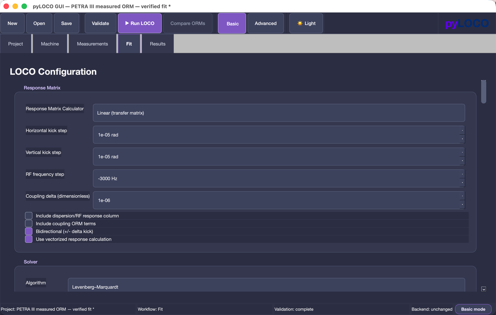

> Highlight the Linear / Analytical / Tracking dropdown and explain that it changes the ORM implementation.

### 3.2 Normal quadrupole Jacobian

Location: the **Jacobian Calculators** group, row **Normal quadrupole Jacobian**.

Choices:

- **Numerical**
- **Analytical**

This selector changes the derivative implementation, not the ORM implementation.

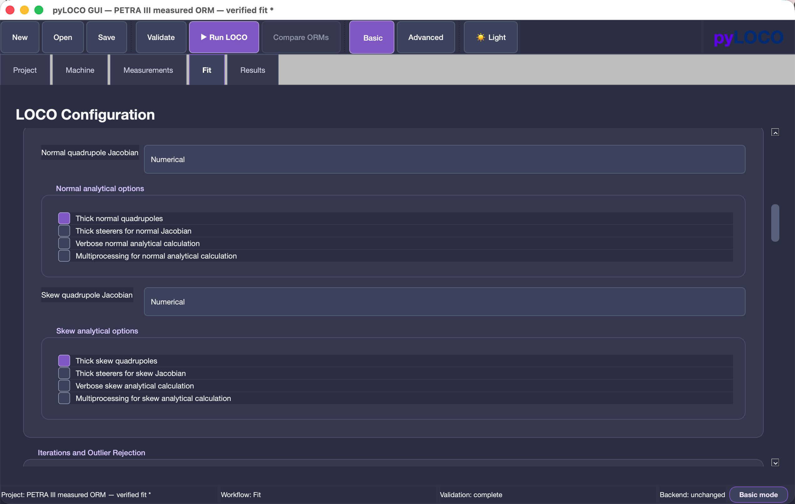

> Highlight the Numerical / Analytical dropdown and explain that it changes dORM/dK.

The two saved choices appear independently in **Results → Overview**, for example `ORM: Linear` and `Normal Jacobian: Numerical`.

---

## 4. Exercise 1 — One-iteration Jacobian validation

### Purpose

Learn the complete GUI workflow and make a controlled first comparison of Numerical and Analytical normal-quadrupole Jacobians with the ORM fixed to Linear.

### Required runs

Set **Outer iterations = 1**.

| Run | Response Matrix Calculator | Normal quadrupole Jacobian |
|---:|---|---|
| 1 | Linear | Numerical |
| 2 | Linear | Analytical |

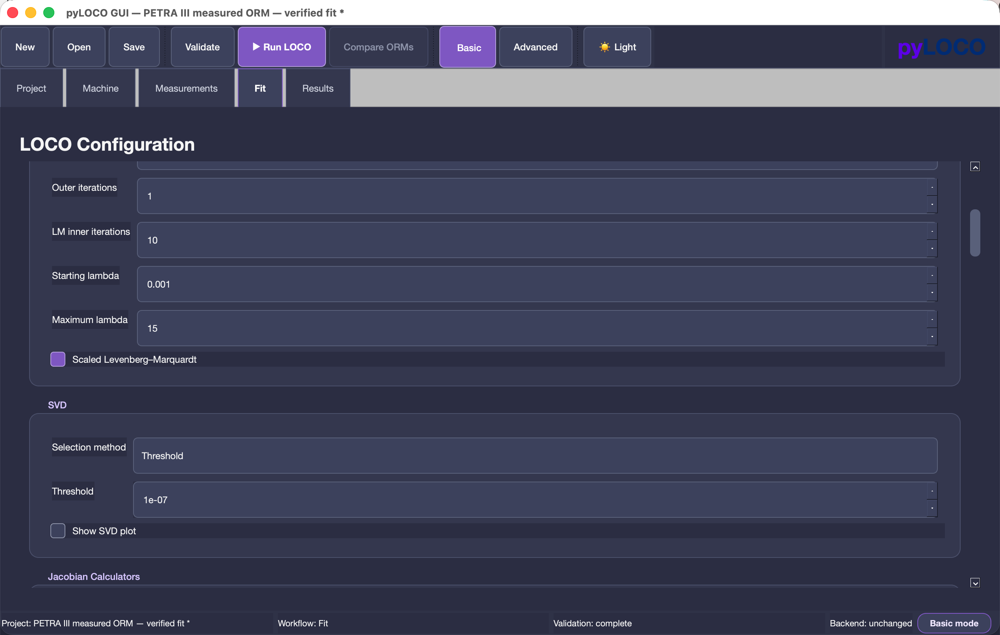

> Highlight `1` for Exercise 1. Later exercises use `8`.

### Reset before each run

1. Reopen `Examples/PETRAIII/GUI/petra_iii.pyloco.json` with **File → Open…**.
2. Confirm **Start from current model**.
3. Confirm Resume is not selected.
4. Confirm `CMstep.npz` remains selected.
5. Set **Outer iterations = 1**.
6. Select the required calculator pair.
7. Leave every other setting unchanged.
8. Click **▶ Run LOCO** in the main toolbar. The same action is available in the **Project** menu.

Reopening the original project prevents a previous fitted lattice or a changed setting from becoming part of the next independent run.


> Highlight **▶ Run LOCO** in the main toolbar.

When the run starts, the GUI switches to **Results**, initially showing the **Log** tab. The **Backend Run Monitor** shows status, elapsed time, progress, and the results directory. When finished, the GUI reports completion and selects **Results → Overview**.

Follow Section 7, locate `iteration_metrics.csv`, and complete the Exercise 1 table in Section 9.

Main question:

> With the ORM calculation fixed to Linear, how similar is the first LOCO correction obtained with Numerical and Analytical normal-quadrupole Jacobians?

Compare the first fitted quadrupole changes, χ², ORM residual, beta beating, dispersion diagnostic, Jacobian time, and total Runtime—not only final χ².

---

## 5. Exercise 2 — ORM calculator comparison

### Purpose

Compare the three ORM implementations while keeping the Jacobian approach fixed.

Use **Normal quadrupole Jacobian = Numerical** and **Outer iterations = 8**.

| Run | Response Matrix Calculator | Normal quadrupole Jacobian |
|---:|---|---|
| 1 | Linear | Numerical |
| 2 | Analytical | Numerical |
| 3 | Tracking | Numerical |

Before every run, reopen the original project, select **Start from current model**, do not use Resume, verify `CMstep.npz`, and change only the Response Matrix Calculator.

### 5.1 Validate the initial ORM first

Before interpreting convergence, compare the **Initial model** ORM and **Residual before** for Linear, Analytical, and Tracking in **Results → ORM**.

This is an implementation-validation question separate from the convergence study. It tests agreement before LOCO corrections complicate the interpretation.

Ask:

- How closely do the Linear and Analytical initial model ORMs agree?
- How closely do they agree with Tracking?
- Are differences uniform or localized to particular BPM/corrector regions?
- Are the initial raw ORM RMS/residual values similar?
- Could differences in later convergence already be explained by initial ORM differences?

### 5.2 Use the saved eight-iteration history

Do not repeat separate 1-, 2-, 3-, 5-, and 8-iteration fits. A single eight-iteration run stores the complete per-iteration history.

Extract iterations **1, 2, 3, 5, and 8** from the **Per-iteration convergence and timing** table in Overview and/or `iteration_metrics.csv` in the timestamped run directory.

Complete the convergence table in Section 9 for all three runs.

---

## 6. Exercise 3 — Jacobian convergence comparison

### Purpose

Compare Numerical and Analytical normal-quadrupole Jacobians while keeping the ORM implementation fixed.

Use **Response Matrix Calculator = Linear** and **Outer iterations = 8**.

| Run | Response Matrix Calculator | Normal quadrupole Jacobian |
|---:|---|---|
| 1 | Linear | Numerical |
| 2 | Linear | Analytical |

The Linear + Numerical eight-iteration result from Exercise 2 can be reused if it followed exactly the same starting-condition procedure. Run Linear + Analytical after reopening the original project.

Again, extract iterations **1, 2, 3, 5, and 8** from the saved history rather than repeating separate fits.

### 6.1 Direct Jacobian validation at two levels

**A. Indirect comparison through LOCO (required)**

Compare the first correction and fitted quadrupole changes; χ² and ORM residual; convergence; beta beating and dispersion diagnostic; and Jacobian time and total Runtime.

**B. Direct artifact comparison (optional/advanced)**

The timestamped run directories contain saved Jacobian artifacts. A direct numerical comparison can examine matrix dimensions, agreement, relative differences, correlation, and the largest discrepancies.

The current GUI does **not** provide a direct Numerical-versus-Analytical Jacobian matrix comparison tool. This optional work requires inspecting saved files outside the GUI and is described in Appendix C. The required study remains entirely GUI-based.

---

## 7. Results to inspect in the GUI

### 7.1 Results → Overview

Record Initial χ², Final χ², reduction, Runtime, completed iterations, fitted DOFs, saved calculator choices, overall raw ORM RMS before/after, and the per-iteration rows.

The per-iteration table displays iteration, χ², overall/H/V ORM RMS [m], beta-x/y RMS [%], Dx/Dy RMS [mm], Model ORM [s], Jacobian [s], Trial ORM [s], All ORM [s], Iteration [s], and Cumulative [s].

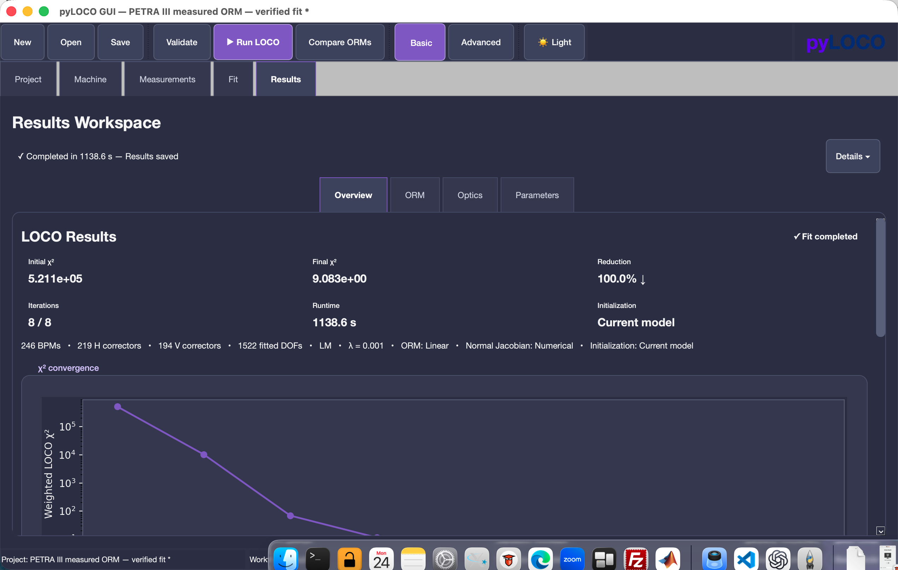

> Highlight Initial χ², Final χ², ORM RMS, Runtime, fitted DOFs, and calculator metadata.

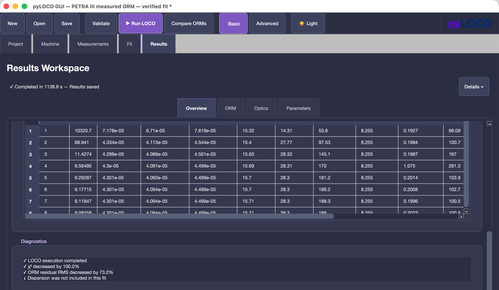

> Highlight the convergence and timing table.

### 7.2 Results → ORM

For fitted results select **Residual after** and **Heatmap**. Record RMS, maximum absolute residual, and matrix dimensions. The heatmap is measured ORM minus fitted-model ORM. Statistics use the full matrix even if the display is down-sampled.

For Exercise 2 initial validation, also inspect **Initial model** and **Residual before**.

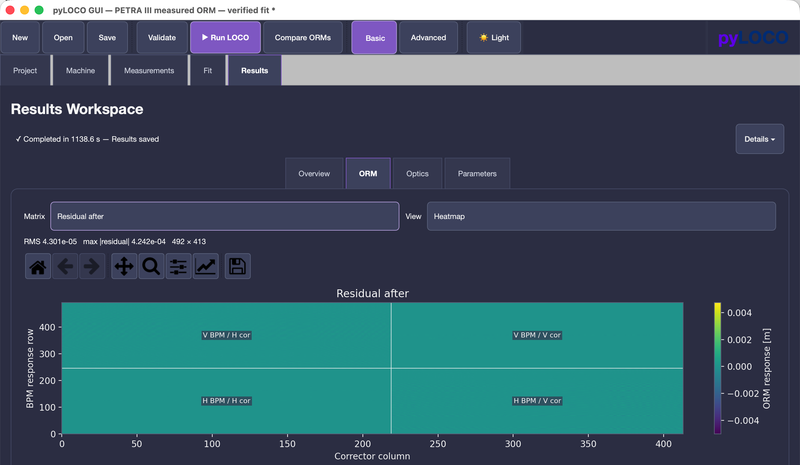

> Select Residual after and Heatmap; highlight RMS and maximum residual.

### 7.3 Results → Optics → Beta beating

Record horizontal and vertical RMS and maximum absolute beta beating [%]. Smaller beta beating means the fitted optics remain closer to the input reference lattice.

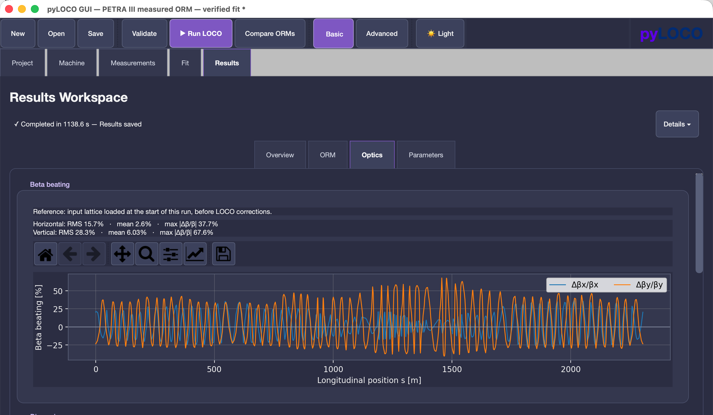

> Highlight beta-x/y curves, RMS values, and maxima.

### 7.4 Results → Optics → Dispersion

Record horizontal and vertical RMS-after and maximum-absolute-residual-after [mm]. Dispersion is a post-fit diagnostic, not part of the default LOCO objective or a direct contribution to χ². Do not enable dispersion fitting.

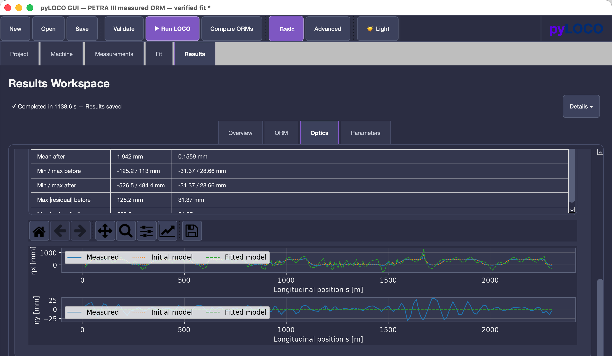

> Highlight Dx/Dy residual RMS and maximum values, plus the diagnostic message.

### 7.5 Results → Parameters

Inspect all active blocks, especially normal-quadrupole changes, horizontal/vertical BPM gains, horizontal/vertical corrector calibration, and horizontal-corrector energy shift. Large parameter differences matter even when final χ² values are similar.

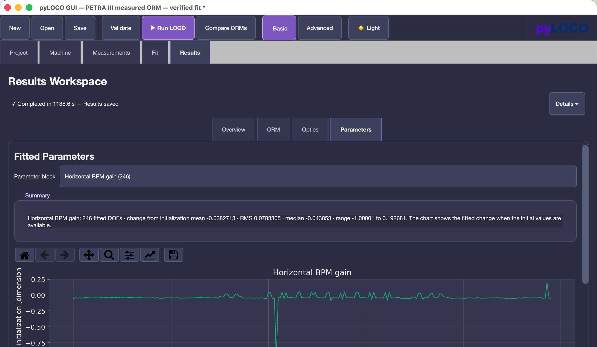

> Highlight the parameter-block selector, fitted changes, and summary.

### 7.6 Results → Files

In Advanced mode, select an artifact and use **Open containing folder** or **Copy selected path**.

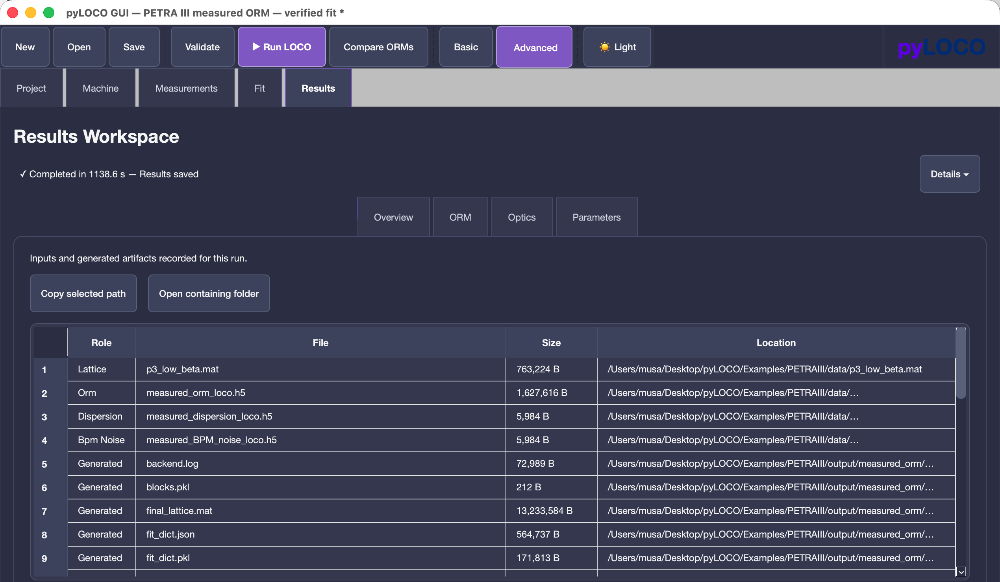

> Highlight **Open containing folder**.

`iteration_metrics.csv` is inside the timestamped run directory. One row represents one completed outer iteration. Use rows 1, 2, 3, 5, and 8 rather than transcribing values from plots.

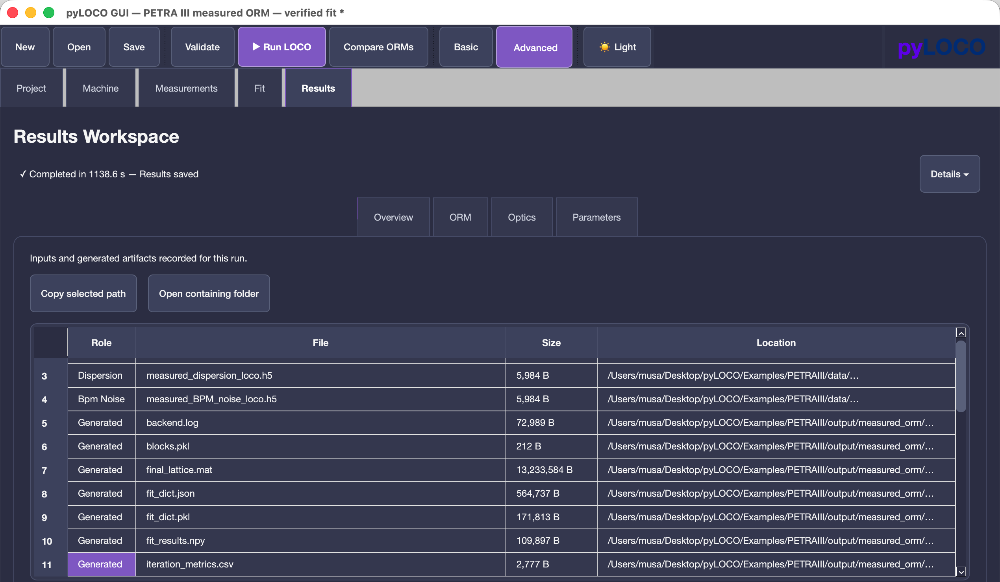

> Show the file and explain that it is the main scalar convergence-data file.

---

## 8. Timing comparison

All timings are in seconds.

| GUI/saved term | Meaning | Use |
|---|---|---|
| **Model ORM [s]** / `model_orm_seconds` | Main model ORM evaluation at the beginning of an iteration | Main ORM-evaluation cost |
| **Trial ORM [s]** / `trial_orm_seconds` | Total trial-ORM time while selecting the correction | Fitting-workflow ORM cost |
| `final_orm_seconds` | Post-correction ORM; saved in CSV/JSON, not a separate Overview column | Final ORM-evaluation cost |
| **All ORM [s]** / `total_orm_seconds` | Model + trial + final ORM time in that iteration | Total ORM-related cost inside the LOCO iteration |
| **Jacobian [s]** / `jacobian_seconds` | Jacobian construction | Derivative cost |
| **Iteration [s]** / `iteration_seconds` | Complete outer-iteration wall time | Per-iteration workflow cost |
| **Cumulative [s]** / `cumulative_seconds` | Time from iteration-loop start through the current iteration | Time-to-iteration |
| **Runtime** / `runtime_seconds` | Total backend time, including setup and saved-output work | Total LOCO cost |

**All ORM [s] is not necessarily the time of one isolated ORM calculation.** It measures all ORM evaluations performed by the LOCO workflow in that iteration; their number and type can depend on fitting behavior.

Use **Model ORM [s]** for the main model evaluation, **All ORM [s]** for total iteration-level ORM-related cost, **Jacobian [s]** for derivative construction, and **Runtime** for total backend LOCO cost.

---

## 9. Results tables

### 9.1 Exercise 1: one-iteration validation

| ORM | Jacobian | Initial χ² | Final χ² | ORM RMS [m] | βx RMS [%] | βy RMS [%] | Dx RMS [mm] | Dy RMS [mm] | Jacobian time [s] | Runtime [s] |
|---|---|---:|---:|---:|---:|---:|---:|---:|---:|---:|
| Linear | Numerical |  |  |  |  |  |  |  |  |  |
| Linear | Analytical |  |  |  |  |  |  |  |  |  |

### 9.2 Exercises 2 and 3: convergence

| ORM | Jacobian | Iteration | χ² | ORM RMS overall [m] | ORM RMS H [m] | ORM RMS V [m] | βx RMS [%] | βy RMS [%] | Dx RMS [mm] | Dy RMS [mm] | Model ORM time [s] | All ORM time [s] | Jacobian time [s] | Cumulative time [s] |
|---|---|---:|---:|---:|---:|---:|---:|---:|---:|---:|---:|---:|---:|---:|
|  |  | 1 |  |  |  |  |  |  |  |  |  |  |  |  |
|  |  | 2 |  |  |  |  |  |  |  |  |  |  |  |  |
|  |  | 3 |  |  |  |  |  |  |  |  |  |  |  |  |
|  |  | 5 |  |  |  |  |  |  |  |  |  |  |  |  |
|  |  | 8 |  |  |  |  |  |  |  |  |  |  |  |  |

Duplicate these five rows for each calculator combination.

---

## 10. Scientific questions

### ORM implementation

1. How closely do Linear and Analytical ORMs agree before correction?
2. How different is Tracking from the two optics-based methods?
3. Are initial differences uniform or localized?
4. Do the three methods converge toward similar χ² and residuals?
5. Which gives the lowest ORM residual, beta beating, and dispersion residual?
6. How different are fitted quadrupole changes?

### Jacobian implementation

1. Does Analytical reproduce the first Numerical-Jacobian correction?
2. Are fitted quadrupole changes and other blocks similar?
3. Do both reach similar χ² and ORM residual?
4. Are beta beating and dispersion similar?
5. Does agreement improve or worsen over several iterations?

### Convergence and timing

1. Which method is fastest by iteration count?
2. Which is fastest to reach a comparable solution in wall-clock time?
3. Does a faster iteration compensate for needing more iterations?
4. How much Jacobian time does Analytical save?
5. Does the fastest Jacobian also give the fastest total Runtime?
6. Do methods reach similar physical parameters, or only similar χ²?

---

## 11. Checklist before every run

- [ ] Correct PETRA III project reopened
- [ ] Project validation complete
- [ ] **Start from current model** selected
- [ ] Resume not selected
- [ ] Correct Response Matrix Calculator selected
- [ ] Correct Normal quadrupole Jacobian selected
- [ ] Correct Outer iterations (`1` or `8`)
- [ ] Corrector step mode is **Load from file**
- [ ] `CMstep.npz` remains selected
- [ ] Solver, SVD, fit parameters, initialization, and constraints unchanged
- [ ] Dispersion fitting remains disabled
- [ ] Other heavy computation avoided during timing comparisons

After each run, verify both calculator choices in Overview and associate the timestamped directory with the correct table entry.

---

## Appendix A — Optional extended study: full ORM × Jacobian matrix

The introductory study does not require all six combinations.

| Response Matrix Calculator | Numerical Jacobian | Analytical Jacobian |
|---|---|---|
| Linear | Required | Required |
| Analytical | Required for Exercise 2 | Optional extension |
| Tracking | Required for Exercise 2 | Optional extension |

Analytical + Analytical and Tracking + Analytical test whether conclusions about Analytical versus Numerical Jacobians remain valid with other ORM implementations. Apply the same reset procedure and use eight-iteration histories.

---

## Appendix B — Saved files, metrics, and metadata

The repository-relative output root is:

```text
Examples/PETRAIII/output/measured_orm/
```

Each run creates `<project-name>-YYYYMMDD-HHMMSS`. The exact directory appears in the run monitor and backend log.

| Artifact | Purpose |
|---|---|
| `run_request.json` | Exact GUI/backend configuration snapshot |
| `summary.json` | Summary, calculator metadata, full per-iteration records, parameter snapshots, timing |
| `iteration_metrics.csv` | Scalar metrics and timing, one row per iteration |
| `backend.log` | Backend progress and diagnostics |
| `model_orm_initial.h5` | Initial model ORM |
| `loco_results.npz` | Fit history, fitted ORM, BPM matrix, χ² history |
| `optics_results.npz` | Beta-beating and dispersion diagnostics |
| `fit_dict.json`, `fit_dict.pkl` | Fitted parameter dictionary |
| `fit_results.npy` | Fitted parameter history |
| `blocks.pkl` | Fitted parameter-block slices |
| `final_lattice.mat`, `ring_pyloco.mat` | Final and Resume-compatible fitted lattice |
| `jacobians/` | Run-local Jacobian artifacts |

`iteration_metrics.csv` contains χ²; overall/H/V ORM RMS; beta-x/y RMS; dispersion-x/y RMS; model, trial, final, and total ORM time; Jacobian time; iteration time; and cumulative time.

Overview presents the main scalar history. `summary.json` contains complete per-iteration records, including fitted parameter snapshots not duplicated into the CSV. `backend.log` records execution progress.

Metadata includes:

```text
response_matrix_calculator
normal_quad_jacobian
normal_quad_jacobian_orm_calculator
```

For Numerical Jacobians, the last field records the ORM calculator used by finite differences. For Analytical Jacobians it is null.

---

## Appendix C — Optional direct Jacobian comparison

Jacobian artifacts are stored inside each timestamped run directory under `jacobians/` as applicable. A direct comparison can check dimensions and ordering, absolute and relative differences, correlation, difference norms, and the largest discrepancies.

This is not available as a dedicated GUI comparison view. It requires an external HDF5/numerical-analysis tool and is optional; do not modify the saved artifacts. The main exercises require only `pyloco-gui`.

---

## Appendix D — Screenshot plan

| No. | GUI tab/panel | Show | Highlight/caption |
|---:|---|---|---|
| 1 | File → Open… | `petra_iii.pyloco.json` | Open the verified repository-relative project. |
| 2 | Project | Name and validation | Project complete; Run LOCO enabled. |
| 3 | Machine configuration | Lattice and counts | Keep supplied selections. |
| 4 | Measurements | ORM, dispersion, BPM noise | Keep supplied files. |
| 5 | Response Matrix | Calculator dropdown | Changes ORM implementation. |
| 6 | Jacobian Calculators | Normal quadrupole dropdown | Changes derivative implementation. |
| 7 | Solver | Outer iterations | Use 1, then 8. |
| 8 | Corrector Steps | Load from file, `CMstep.npz` | Preserve measured steps. |
| 9 | Initialization / Resume | Start from current model | Do not Resume independent runs. |
| 10 | Main toolbar | ▶ Run LOCO | Start the run. |
| 11 | Results → Overview | χ², ORM RMS, Runtime, metadata | Record and verify. |
| 12 | Results → Overview | Per-iteration table | Use iterations 1, 2, 3, 5, 8. |
| 13 | Results → ORM | Residual after, Heatmap | RMS, maximum, dimensions. |
| 14 | Results → Optics | Beta beating | x/y RMS and maxima. |
| 15 | Results → Optics | Dispersion | Post-fit diagnostic. |
| 16 | Results → Parameters | Blocks and changes | Compare physical solutions. |
| 17 | Results → Files | Open containing folder | Locate output. |
| 18 | Output folder | `iteration_metrics.csv` | Scalar convergence data. |

Screenshots 3–4 or 11–12 may be combined only if all required information remains legible.
